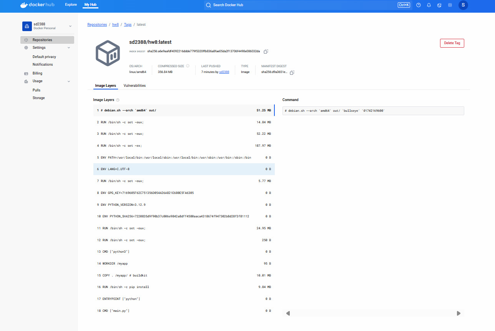

# hw8
# CI/CD Pipeline Project

## Overview
This project demonstrates setting up a CI/CD pipeline using GitHub Actions to automatically test, build, and push a Docker image to DockerHub.

## DockerHub Image
Below is a screenshot of the Docker image published in my DockerHub account:

